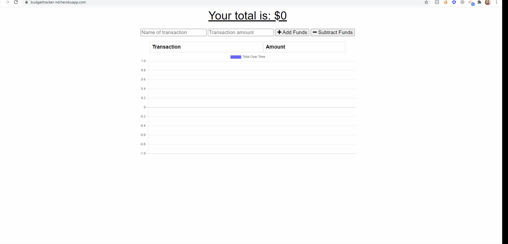

# Budget Tracker

## Description

With this Budget Tracker application, a user is able to add expenses and deposits to their budget with or without a connection. When they are online, the Budget Tracker populates their total right away. When they are offline, they can still add transactions, and when they are online again, the total will populate. 

## Table of Contents

 * [Installation](#installation)
  * [Usage](#usage)
  * [Demo](#demo)
  * [Contact](#contact)

  ## Installation 
    1. Clone repo
    2. Install NPM packages
    

## Usage

To use the app all you have to do is: 
* Open the app
* Add transactions

Or you can use the deployed Heroku link [here](https://workout-tracker-nd.herokuapp.com/)!

## Demo

## Contact

* Nadine Delaire :  ndelaire16@gmail.com
* Repo: https://github.com/ndelaire/budget_tracker
